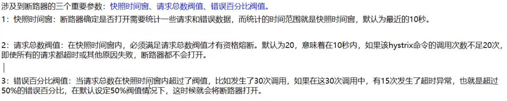

# Hystrix

# 1.服务降级
## 1.1服务提供者

### 1.1.1 新建模块作为服务提供者

### 1.1.2导入依赖
```xml
<dependencies>
        <dependency>
            <groupId>org.springframework.cloud</groupId>
            <artifactId>spring-cloud-starter-netflix-hystrix</artifactId>
        </dependency>
        <dependency>
            <groupId>org.springframework.cloud</groupId>
            <artifactId>spring-cloud-starter-netflix-eureka-client</artifactId>
        </dependency>
        <dependency>
            <groupId>cn.SGMing</groupId>
            <artifactId>spring-api-commons</artifactId>
            <version>1.0-SNAPSHOT</version>
        </dependency>
        <!-- https://mvnrepository.com/artifact/org.springframework.boot/spring-boot-starter-web -->
        <dependency>
            <groupId>org.springframework.boot</groupId>
            <artifactId>spring-boot-starter-web</artifactId>
        </dependency>

        <!-- https://mvnrepository.com/artifact/org.springframework.boot/spring-boot-starter-web -->
        <dependency>
            <groupId>org.springframework.boot</groupId>
            <artifactId>spring-boot-starter-actuator</artifactId>
        </dependency>

        <!-- https://mvnrepository.com/artifact/org.springframework.boot/spring-boot-starter-web -->
        <dependency>
            <groupId>org.mybatis.spring.boot</groupId>
            <artifactId>mybatis-spring-boot-starter</artifactId>
        </dependency>

        <!-- https://mvnrepository.com/artifact/com.alibaba/druid -->
        <dependency>
            <groupId>com.alibaba</groupId>
            <artifactId>druid-spring-boot-starter</artifactId>
            <version>1.2.8</version>
        </dependency>
        <!-- https://mvnrepository.com/artifact/mysql/mysql-connector-java -->
        <dependency>
            <groupId>mysql</groupId>
            <artifactId>mysql-connector-java</artifactId>
        </dependency>

        <!-- https://mvnrepository.com/artifact/org.springframework.boot/spring-boot-starter-jdbc -->
        <dependency>
            <groupId>org.springframework.boot</groupId>
            <artifactId>spring-boot-starter-jdbc</artifactId>
        </dependency>

        <!-- https://mvnrepository.com/artifact/org.springframework.boot/spring-boot-devtools -->
        <dependency>
            <groupId>org.springframework.boot</groupId>
            <artifactId>spring-boot-devtools</artifactId>
            <scope>runtime</scope>
            <optional>true</optional>
        </dependency>

        <!-- https://mvnrepository.com/artifact/org.projectlombok/lombok -->
        <dependency>
            <groupId>org.projectlombok</groupId>
            <artifactId>lombok</artifactId>
            <optional>true</optional>
        </dependency>

        <!-- https://mvnrepository.com/artifact/org.springframework.boot/spring-boot-starter-test -->
        <dependency>
            <groupId>org.springframework.boot</groupId>
            <artifactId>spring-boot-starter-test</artifactId>
            <scope>test</scope>
        </dependency>
    </dependencies>
```

### 1.1.3添加yaml配置文件
```yaml
server:
  port: 8001
spring:
  application:
    # 服务名自定义
    name: cloud-provider-hystrix-payment
  datasource:
    type: com.alibaba.druid.pool.DruidDataSource
    driver-class-name: com.mysql.jdbc.Driver
    url: jdbc:mysql://localhost:3306/db2019?useUnicode=true&characterEncoding=utf-8&useSSL=false
    username: root
    password: root
eureka:
  client:
    service-url:
      # eureka注册地址
      defaultZone: http://eureka7001.com:7001/eureka
    register-with-eureka: true
    fetch-registry: true
```

### 1.1.4编写引导类
```java
@SpringBootApplication
@EnableEurekaClient
@EnableDiscoveryClient
@EnableCircuitBreaker
public class HystrixPayment8001 {
    public static void main(String[] args) {
        SpringApplication.run(HystrixPayment8001.class, args);
    }
}
```

### 1.1.5编写service层
```java
@Service
public class PaymentService {

    /**
     * 正常访问
     * @param id
     * @return
     */
    public String paymentInfoOK(Integer id) {
        return "线程池:" + Thread.currentThread().getName() + "-id:" + id + "-ok";
    }

    // fallbackMethod指定出现异常或超时等情况走的方法
    @HystrixCommand(fallbackMethod = "paymentInfoErrorHandler", commandProperties = {
            //设置超时时间
            @HystrixProperty(name = "execution.isolation.thread.timeoutInMilliseconds", value = "2000")
    })
    public String paymentInfoError(Integer id) {
        //线程睡眠2秒
        try {
            //可以测试超时和异常，都会执行指定的：paymentInfoErrorHandler方法
            System.out.println(1/id);
            TimeUnit.SECONDS.sleep(2);
        } catch (Exception e) {
            throw new RuntimeException(e);
        }
        return "线程池:" + Thread.currentThread().getName() + "-id:" + id + "-error";
    }


    public String paymentInfoErrorHandler(Integer id) {
        return "线程池:" + Thread.currentThread().getName() + "-errorHandler";
    }
}
```
> **注意：**fallbackMethod选择的方法的参数需要和原方法的参数相同
> 
> 详细的参数可以看：HystrixCommandProperties 这个类
> 
### 1.1.6controller层
```java
@RestController
@RequestMapping("/payment/hystrix")
@Slf4j
public class PaymentController {
    @Autowired
    private PaymentService paymentService;
    @Value("${server.port}")
    private String serverPort;

    @GetMapping("/ok/{id}")
    public String paymentInfoOK(@PathVariable("id") Integer id) {
        String result = paymentService.paymentInfoOK(id);
        log.info("result: {}", result);
        return result;
    }
    @GetMapping("/error/{id}")
    public String paymentInfoError(@PathVariable("id") Integer id) {
        String result = paymentService.paymentInfoError(id);
        log.info("result: {}", result);
        return result;
    }
}
```
### 1.1.7测试


## 1.2消费者

### 1.2.1新建消费者模块模块

### 1.2.2pom文件
```xml
<dependencies>
        <dependency>
            <groupId>org.springframework.cloud</groupId>
            <artifactId>spring-cloud-starter-netflix-hystrix</artifactId>
        </dependency>
        <dependency>
            <groupId>org.springframework.cloud</groupId>
            <artifactId>spring-cloud-starter-openfeign</artifactId>
        </dependency>
        <dependency>
            <groupId>org.springframework.cloud</groupId>
            <artifactId>spring-cloud-starter-netflix-eureka-client</artifactId>
        </dependency>
        <dependency>
            <groupId>cn.SGMing</groupId>
            <artifactId>spring-api-commons</artifactId>
            <version>1.0-SNAPSHOT</version>
        </dependency>
        <!-- https://mvnrepository.com/artifact/org.springframework.boot/spring-boot-starter-web -->
        <dependency>
            <groupId>org.springframework.boot</groupId>
            <artifactId>spring-boot-starter-web</artifactId>
        </dependency>

        <!-- https://mvnrepository.com/artifact/org.springframework.boot/spring-boot-starter-web -->
        <dependency>
            <groupId>org.springframework.boot</groupId>
            <artifactId>spring-boot-starter-actuator</artifactId>
        </dependency>

        <!-- https://mvnrepository.com/artifact/org.springframework.boot/spring-boot-starter-web -->
        <dependency>
            <groupId>org.mybatis.spring.boot</groupId>
            <artifactId>mybatis-spring-boot-starter</artifactId>
        </dependency>

        <!-- https://mvnrepository.com/artifact/com.alibaba/druid -->
        <dependency>
            <groupId>com.alibaba</groupId>
            <artifactId>druid-spring-boot-starter</artifactId>
            <version>1.2.8</version>
        </dependency>
        <!-- https://mvnrepository.com/artifact/mysql/mysql-connector-java -->
        <dependency>
            <groupId>mysql</groupId>
            <artifactId>mysql-connector-java</artifactId>
        </dependency>

        <!-- https://mvnrepository.com/artifact/org.springframework.boot/spring-boot-starter-jdbc -->
        <dependency>
            <groupId>org.springframework.boot</groupId>
            <artifactId>spring-boot-starter-jdbc</artifactId>
        </dependency>

        <!-- https://mvnrepository.com/artifact/org.springframework.boot/spring-boot-devtools -->
        <dependency>
            <groupId>org.springframework.boot</groupId>
            <artifactId>spring-boot-devtools</artifactId>
            <scope>runtime</scope>
            <optional>true</optional>
        </dependency>

        <!-- https://mvnrepository.com/artifact/org.projectlombok/lombok -->
        <dependency>
            <groupId>org.projectlombok</groupId>
            <artifactId>lombok</artifactId>
            <optional>true</optional>
        </dependency>

        <!-- https://mvnrepository.com/artifact/org.springframework.boot/spring-boot-starter-test -->
        <dependency>
            <groupId>org.springframework.boot</groupId>
            <artifactId>spring-boot-starter-test</artifactId>
            <scope>test</scope>
        </dependency>

        <!--包含了sleuth+zipkin-->
        <!--        <dependency>-->
        <!--            <groupId>org.springframework.cloud</groupId>-->
        <!--            <artifactId>spring-cloud-starter-zipkin</artifactId>-->
        <!--        </dependency>-->

    </dependencies>
```

### 1.2.3添加yaml配置文件
```yaml
server:
  port: 8007
spring:
  application:
    name: cloud-consumer-hystrix-order
  datasource:
    type: com.alibaba.druid.pool.DruidDataSource
    driver-class-name: com.mysql.jdbc.Driver
    url: jdbc:mysql://localhost:3306/db2019?useUnicode=true&characterEncoding=utf-8&useSSL=false
    username: root
    password: root
eureka:
  client:
    service-url:
      defaultZone: http://eureka7001.com:7001/eureka
    register-with-eureka: true
    fetch-registry: true

ribbon:
  # 建立连接所用时间，适用于网络状态正常的情况，两端连接所用的时间
  ReadTimeout: 3000
  # 建立连接后从服务器读取可用资源的所用时间
  ConnectTimeout: 3000

# feign开启hystrix
feign:
  hystrix:
    enabled: true
```
### 1.2.4引导类
```java
@SpringBootApplication
@EnableFeignClients
//@EnableHystrix 和 @EnableCircuitBreaker都可以
@EnableHystrix
//@EnableCircuitBreaker
public class OrderHystrix8007 {

    public static void main(String[] args) {
        SpringApplication.run(OrderHystrix8007.class, args);
    }
}
```

### 1.2.5service层（与之前的feign的service一样）
```java
@Service
@FeignClient(value = "cloud-provider-hystrix-payment")
public interface PaymentHystrixService {

    @GetMapping("/payment/hystrix/error/{id}")
    String paymentInfoError(@PathVariable("id") Integer id);

    @GetMapping("/payment/hystrix/ok/{id}")
    String paymentInfoOK(@PathVariable("id") Integer id);
}
```
### 1.2.6controller层
```java
@RestController
@RequestMapping("/consumer")
@Slf4j
public class OrderHystrixController {
    @Autowired
    private PaymentHystrixService paymentHystrixService;


    @GetMapping("/payment/hystrix/ok/{id}")
    public String paymentInfoOK(@PathVariable("id") Integer id) {
        return paymentHystrixService.paymentInfoOK(id);
    }

    @GetMapping("/payment/hystrix/error/{id}")
    @HystrixCommand(fallbackMethod = "paymentInfoErrorHandler", commandProperties = {
            //设置超时时间1.5s后就执行兜底的方法
            @HystrixProperty(name = "execution.isolation.thread.timeoutInMilliseconds", value = "1500")
    })
//    @HystrixCommand
    public String paymentInfoError(@PathVariable("id") Integer id) {
        System.out.println(1/id);
        return paymentHystrixService.paymentInfoError(id);
    }

    public String paymentInfoErrorHandler(Integer id) {
        return "线程池:" + Thread.currentThread().getName() + "-errorHandler-错误或超时";
    }
}
```
### 1.1.7测试

## 1.3配置默认全局fallback方法
消费者的controller层
```java
@RestController
@RequestMapping("/consumer")
@Slf4j
//指定默认的全局方法
@DefaultProperties(defaultFallback = "defaultFallback")
public class OrderHystrixController {
    @Autowired
    private PaymentHystrixService paymentHystrixService;


    @GetMapping("/payment/hystrix/ok/{id}")
    public String paymentInfoOK(@PathVariable("id") Integer id) {
        return paymentHystrixService.paymentInfoOK(id);
    }

    @GetMapping("/payment/hystrix/error/{id}")
    @HystrixCommand(fallbackMethod = "paymentInfoErrorHandler", commandProperties = {
            //设置超时时间
            @HystrixProperty(name = "execution.isolation.thread.timeoutInMilliseconds", value = "1500")
    })
//    @HystrixCommand
    public String paymentInfoError(@PathVariable("id") Integer id) {
        System.out.println(1/id);
        return paymentHystrixService.paymentInfoError(id);
    }

    public String paymentInfoErrorHandler(Integer id) {
        return "线程池:" + Thread.currentThread().getName() + "-errorHandler-错误或超时";
    }

    //全局的fallback方法
    public String defaultFallback() {
        return "Hystrix的defaultFallback";
    }
}
```
## 1.4配置统配服务降级
### 1.4.1添加一个类实现feign远程调用服务接口PaymentHystrixService
```java
@Component
public class PaymentFallbackService implements PaymentHystrixService{
    @Override
    public String paymentInfoError(Integer id) {
        return "PaymentFallbackService-paymentInfoError error";
    }

    @Override
    public String paymentInfoOK(Integer id) {
        return "PaymentFallbackService-paymentInfoOK error";
    }
}

```

### 1.4.2feign远程调用接口添加注解
    @FeignClient(value = "cloud-provider-hystrix-payment", fallback = PaymentFallbackService.class)


# 2.服务熔断
## 2.1修改提供者service层
```java
@Service
public class PaymentService {

    /**
     * 正常访问
     * @param id
     * @return
     */
    public String paymentInfoOK(Integer id) {
        return "线程池:" + Thread.currentThread().getName() + "-id:" + id + "-ok";
    }

    @HystrixCommand(fallbackMethod = "paymentInfoErrorHandler", commandProperties = {
            //设置超时时间
            @HystrixProperty(name = "execution.isolation.thread.timeoutInMilliseconds", value = "2000")
    })
    public String paymentInfoError(Integer id) {
        //线程睡眠2秒
        try {
            System.out.println(1/id);
            TimeUnit.SECONDS.sleep(2);
        } catch (Exception e) {
            throw new RuntimeException(e);
        }
        return "线程池:" + Thread.currentThread().getName() + "-id:" + id + "-error";
    }


    public String paymentInfoErrorHandler(Integer id) {
        return "线程池:" + Thread.currentThread().getName() + "-errorHandler";
    }

    //服务熔断
    @HystrixCommand(fallbackMethod = "paymentCircuitBreakerFallBack", commandProperties = {
            @HystrixProperty(name = "circuitBreaker.enabled", value = "true"),
            @HystrixProperty(name = "circuitBreaker.requestVolumeThreshold", value = "10"),
            @HystrixProperty(name = "circuitBreaker.errorThresholdPercentage", value = "60"),
            @HystrixProperty(name = "circuitBreaker.sleepWindowInMilliseconds", value = "10000")
    })
    public String paymentCircuitBreaker(@PathVariable("id") Integer id) {
        if (id < 0) {
            throw new RuntimeException("id 不能为负数");
        }
        String serialNumber = IdUtil.simpleUUID();
        return Thread.currentThread().getName() + "\t调用成功，流水号:" + serialNumber;
    }

    public String paymentCircuitBreakerFallBack(@PathVariable("id") Integer id) {
        return "id不能是负数 id:" + id;
    }
}
```

## 2.2controller层添加访问服务熔断
```text
    @GetMapping("/circuit/{id}")
    public String paymentCircuitBreaker(@PathVariable("id") Integer id) {
        String result = paymentService.paymentCircuitBreaker(id);
        log.info("result: {}", result);
        return result;
    }
```
